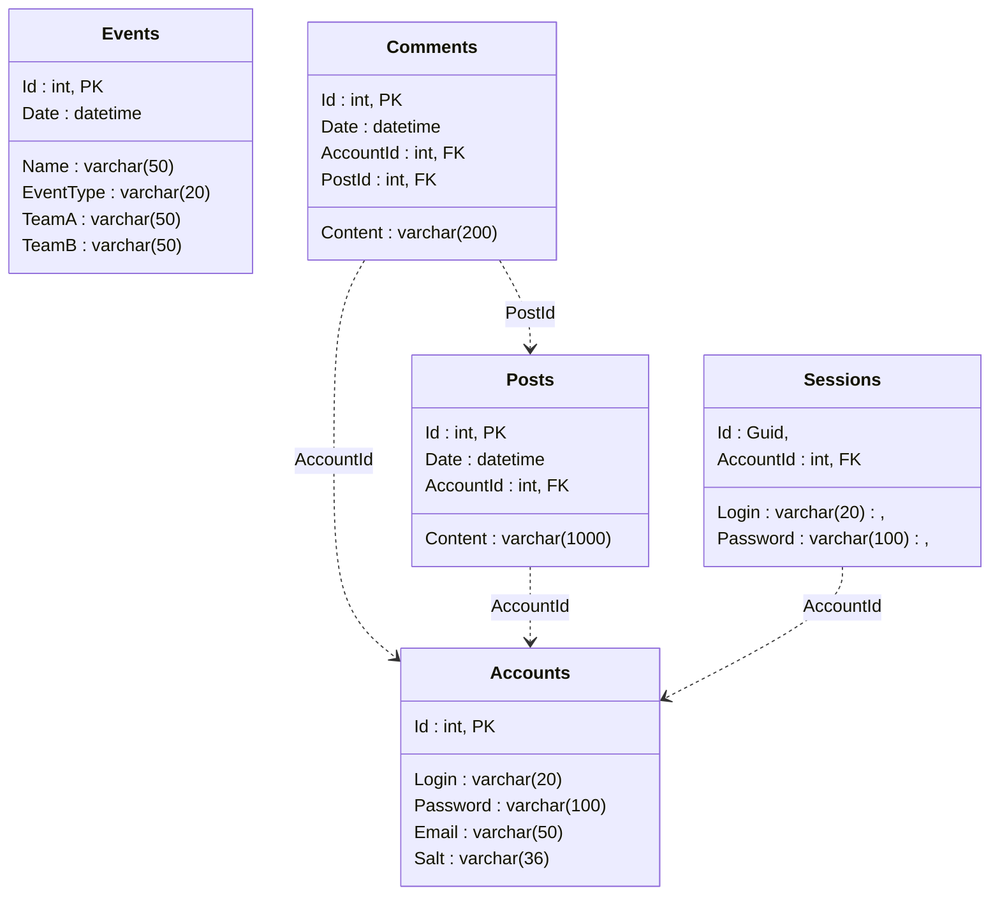

# Sport Room

***Sport room*** - это сайт для любителей спорта.

### ***Быстрый старт***
Создайте БД и выполните все скрипты из папки ```DB/DB scripts```. При необходимости поменять строку подключения на необходимую в файле ```StringConstants.cs```. Для запуска сервера введите команду ```start```, скопируйте ссылку с консоли и вставьте в поисковую строку браузера.

### ***Функционал:***
- регистрация новых пользователей
- управление аккаунтом
- создание постов и их просмотр c комментированием
- расписание спортивных событий

### ***Возможности зарегистрированного пользователя:***
- просмотр постов и спортивных событий
- написание постов и комментариев

### ***Возможности незарегистрированного пользователя:***
- просмотр постов и спортивных событий

## Схема базы данных для Sport room 



### ***Навигация сайта***
1. ```/posts``` - все посты на сайте
2. ```/posts/{PostId}``` - определённый пост с комментариями к нему
3. ```/account``` - настройки аккаунта
4. ```/``` - расписание футбольных матчей
5. ```/{EventType}``` - расписание матчей для определённого вида спорта
6. ```/login``` - страница входа
7. ```/registration``` - страница регистрации
