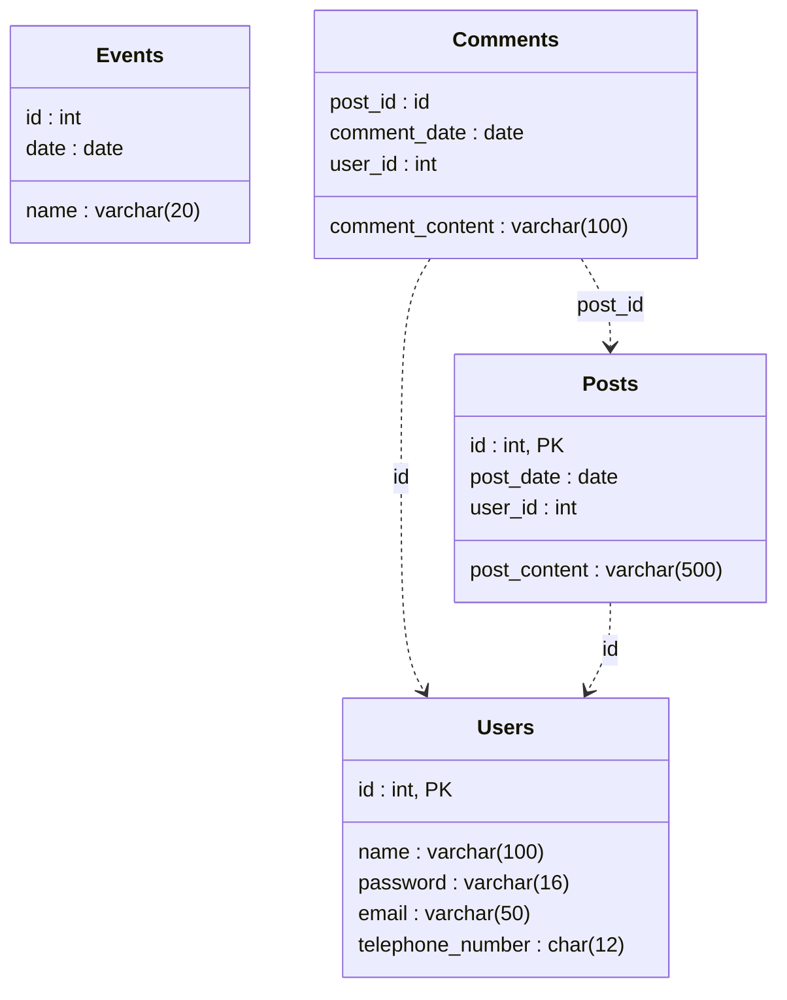

# Sport Room

***Sport room*** - это сайт для любителей спорта.

### ***Функционал:***
- регистрация новых пользователей
- управление аккаунтом
- создание постов и их просмотр
- расписание спортивных событий

### ***Возможности зарегистрированного пользователя:***
- просмотр постов и спортивных событий
- написание постов и комментариев

### ***Возможности незарегистрированного пользователя:***
- просмотр постов и спортивных событий

## Схема базы данных для Sport room 



### ***Роутинг***
1. ```/posts``` - все посты на сайте
2. ```/posts/{post_id}``` - определённый пост с комментариями к нему
3. ```/profile``` - профиль пользователя
4. ```/profile/settings``` - настройки аккаунта
5. ```/schedule``` - расписание событий
6. ```/schedule/{event_name}``` - расписание событий для определённого вида спорта
7. ```/schedule/{event_name}/{event_id}``` - определнное событие
